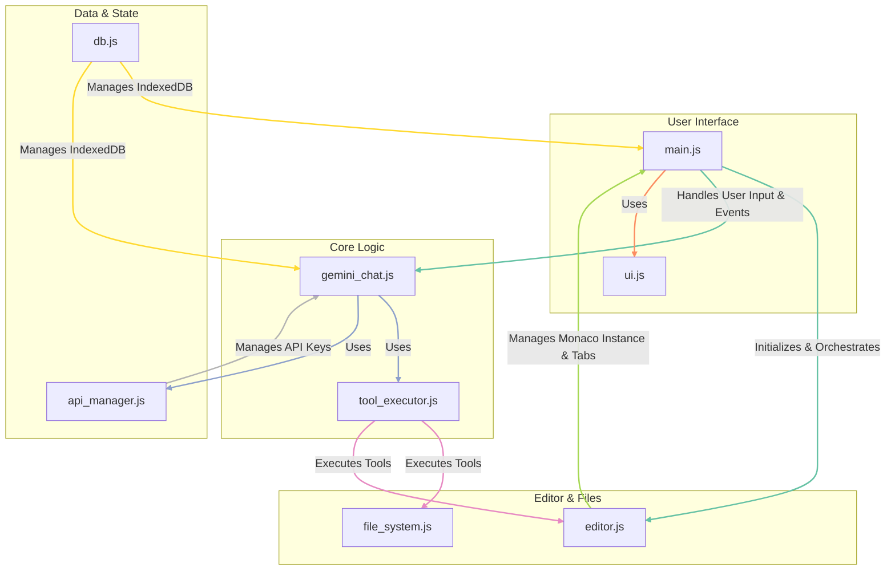
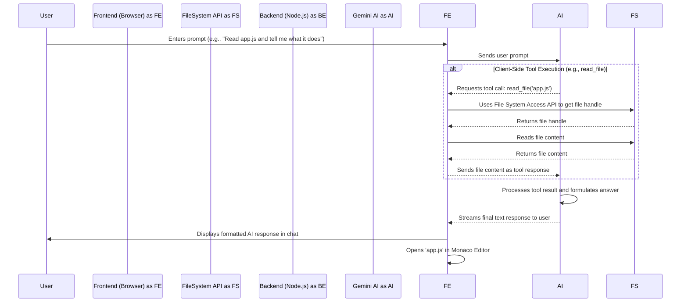
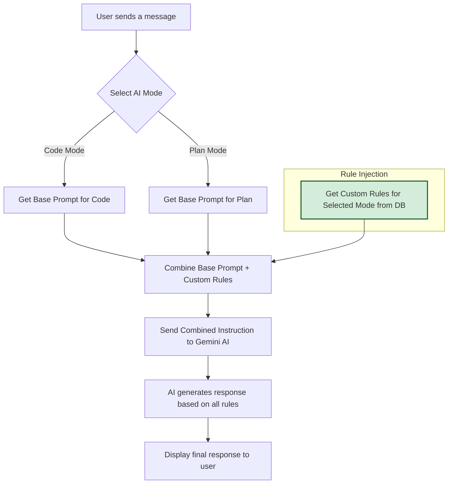

# Application Architecture

This document provides a high-level overview of the application's architecture. For a more detailed guide on the project structure, development workflow, and how to contribute, please see the **[Contributing Guide](./CONTRIBUTING.md)**.

## Core Philosophy: Client-Centric Design

The application is architected to be **secure and frontend-heavy**. The majority of the logic, including all file system interactions, the editor, and the AI agent, runs directly in the browser. A minimal backend is used only for tasks that the browser's sandbox cannot perform.

## Component Overview

*   **Frontend**: A single-page application built with vanilla JavaScript, HTML, and CSS. It uses the Monaco Editor and manages all core application logic.
*   **Backend**: A lightweight Node.js/Express server that serves static files and provides sandboxed execution for terminal commands and URL fetching.
*   **AI Agent**: The Gemini agent logic is managed entirely on the client-side in `frontend/js/gemini_chat.js`, which defines all available tools and orchestrates the interaction with the model.

## Frontend Code Logic Flow

This diagram illustrates the relationships and primary responsibilities of the key JavaScript modules in the `frontend/js` directory.

## End-to-End Workflow

This diagram illustrates the primary interaction flow between the user, frontend, backend, and the Gemini AI.

## State Management

The application's state is persisted entirely within the browser's **IndexedDB**, ensuring a robust and seamless user experience. The database (`CodeEditorDB`) is managed by `frontend/js/db.js` and contains several object stores:

*   **`apiKeys`**: Stores the user's Gemini API keys.
*   **`fileHandles`**: Persists the handle to the root project directory, allowing for quick reconnection.
*   **`sessionState`**: Automatically saves the entire workspace state (open files, active tab, unsaved content, and chat history) before the page unloads. This state is restored when the application starts, preventing any loss of work.
*   **`checkpoints`**: Stores complete, project-wide snapshots. Before the AI executes a destructive operation (like `rewrite_file` or `create_file`), it saves the entire state of the editor (all open files, their content, and view states) as a single checkpoint. This allows for a full, commit-style restore of the workspace to a previous point in time.
*   **`codeIndex`**: Caches a searchable index of the codebase for performance.
*   **`settings`**: Stores miscellaneous user preferences, such as the last selected AI model.
*   **`customRules`**: Stores user-defined rules for each AI mode, allowing for persistent, fine-grained control over the AI's behavior.

This comprehensive state management ensures that both the user's configuration and their work-in-progress are preserved across sessions.

## System Stability and Error Handling

The architecture includes several mechanisms to ensure stability and provide a reliable user experience:

*   **API-Compliant Payloads**: The communication with the Gemini API is carefully structured to adhere to its strict requirements. For instance, `functionResponse` parts are sent in dedicated messages, separate from any other content, preventing API errors and ensuring the tool-calling loop remains stable.
*   **Robust Session Restoration**: The session and file handle management has been hardened to correctly restore the project context, even after a page reload, ensuring that AI tools have immediate and correct access to the file system.
*   **Accurate File Path Generation**: The logic for generating the project's file structure has been corrected to prevent erroneous paths, ensuring that all file-based tool calls (`create_file`, `delete_file`, etc.) operate reliably.

## Custom Rule Injection Workflow

To ensure the AI's behavior can be tailored by the user, custom rules are dynamically injected into the system prompt before every request. This process guarantees that the AI always operates with the most up-to-date instructions for the selected mode.

